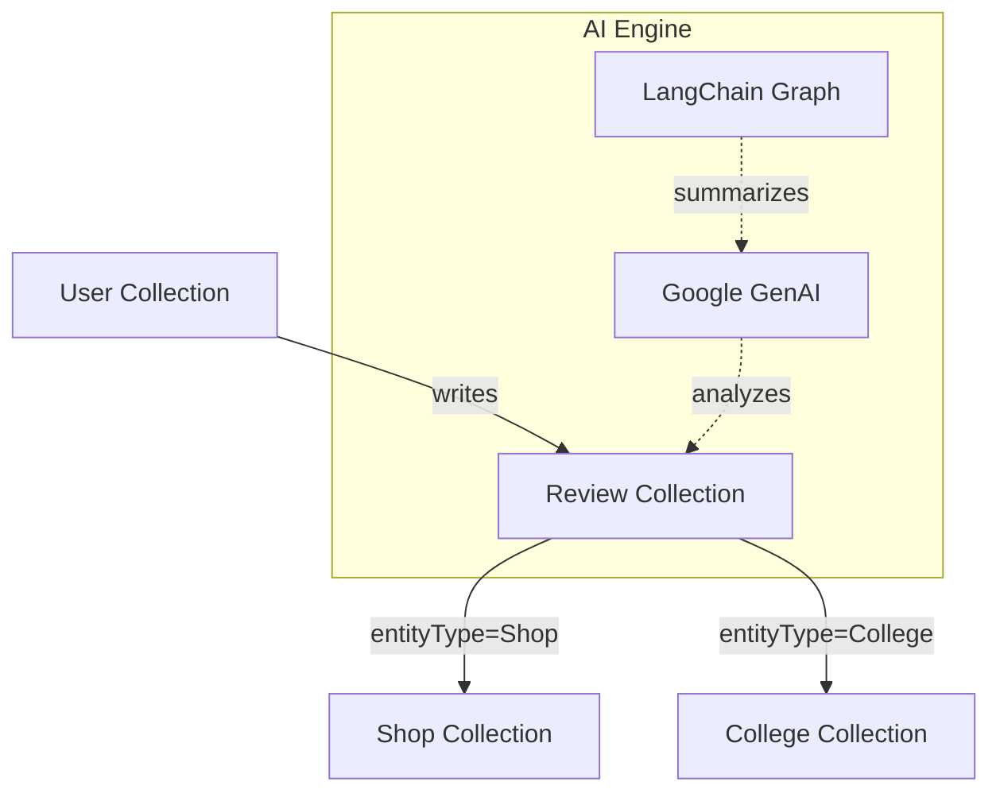

<br/>

## 📖 Overview

**LocalTruth** is a modern, full-stack MERN application that empowers communities to discover, review, and evaluate local shops and colleges. Enhanced with artificial intelligence (LangChain & Google Generative AI), the platform not only collects reviews but intelligently analyzes them to provide summarized insights, trends, and behavioral tags for places in your local area.

The application uses geospatial data for proximity-based discovery and implements a dynamic, scalable architecture designed for speed and reliability.

---

## ✨ Key Features

- **🗺️ Geospatial Discovery**: Find shops and colleges near you using MongoDB geospatial queries (`Point` location types).
- **⭐ Comprehensive Review System**: Users can rate (1-5 stars), comment, and add behavioral tags for entities.
- **🤖 AI-Enhanced Insights**: Integrates Google Generative AI & LangChain to process all reviews for an entity, generating smart summaries and automated sentiment analysis.
- **📊 Real-time Aggregation**: Automatically calculates and updates average ratings and review counts on the fly for incredibly fast read operations.
- **🔐 Secure Authentication**: Robust dual-authentication system utilizing local JWT strategies and Google OAuth via Passport.js.
- **🎨 Premium UI/UX**: A sleek, responsive frontend built with React, Vite, Tailwind CSS, and beautifully animated with Framer Motion.

---

## 🏗️ Architecture & Data Flow

The backend employs a polymorphic schema architecture for maximum flexibility and performance:



### Data Flow Strategy

To maintain highly optimized read speeds, we pre-compute analytics. When a user submits a review:

1. The review is securely stored with dynamic relations (`entityType` and `entityId`).
2. The system triggers an aggregation pipeline.
3. The parent entity (Shop/College) has its `rating` and `ratingCount` fields instantly updated.

---

## 🛠️ Technology Stack

### Frontend

- **Framework**: React 19 + Vite
- **Language**: TypeScript
- **Styling**: Tailwind CSS v4, Framer Motion for micro-interactions
- **Routing**: React Router v7
- **Icons**: Lucide React, React Icons
- **State Management & Fetching**: Context API / Axios

### Backend

- **Server**: Node.js, Express.js
- **Language**: TypeScript
- **Database**: MongoDB (Mongoose)
- **Authentication**: Passport.js (Google OAuth 2.0), JWT, Bcrypt
- **AI Integration**: `@langchain/google-genai`, LangGraph
- **Testing**: Jest, Supertest, MongoDB Memory Server

---

## 🚀 Quick Start Setup

Follow these steps to get the project running locally.

### Prerequisites

- Node.js (v18+ recommended)
- MongoDB running locally or a MongoDB Atlas URI
- Google Gemini API Key
- Google OAuth Client ID & Secret

### 1. Clone the repository

```bash
git clone https://github.com/your-username/LocalTruth.git
cd LocalTruth
```

### 2. Backend Setup

```bash
cd backend
npm install
```

Create a `.env` file in the `backend` directory:

```env
PORT=5000
MONGODB_URI=your_mongodb_connection_string
JWT_SECRET=your_jwt_secret
GOOGLE_CLIENT_ID=your_google_oauth_client_id
GOOGLE_CLIENT_SECRET=your_google_oauth_client_secret
GOOGLE_API_KEY=your_gemini_api_key
```

Start the backend development server:

```bash
npm run dev
```

### 3. Frontend Setup

```bash
cd ../frontend
npm install
```

Create a `.env` file in the `frontend` directory:

```env
VITE_API_BASE_URL=http://localhost:5000/api
```

Start the frontend development server:

```bash
npm run dev
```

---

## 📂 Project Structure

```text
LocalTruth/
├── backend/
│   ├── src/
│   │   ├── api/            # API specific handlers
│   │   ├── config/         # Environment & third-party config (Passport, DB)
│   │   ├── controllers/    # Route controllers
│   │   ├── middleware/     # Auth & error handling
│   │   ├── models/         # Mongoose schemas (User, Shop, College, Review)
│   │   ├── routes/         # Express routers
│   │   ├── services/       # Core business logic & AI integration
│   │   ├── utils/          # Helpers
│   │   ├── validators/     # Request schema validation
│   │   ├── app.ts          # Express app setup
│   │   └── server.ts       # Server entry point
│   └── package.json
└── frontend/
    ├── src/
    │   ├── assets/         # Static assets
    │   ├── components/     # Reusable UI elements
    │   ├── context/        # Global state
    │   ├── pages/          # Full page views (Discovery, Detail, Auth, etc.)
    │   ├── services/       # API call wrappers (Axios)
    │   ├── types/          # TypeScript interfaces
    │   ├── utils/          # Frontend helpers
    │   ├── App.tsx         # Main component tree
    │   └── main.tsx        # React DOM render
    └── package.json
```

---

## 🤝 Contributing

Contributions are what make the open source community such an amazing place to learn, inspire, and create. Any contributions you make are **greatly appreciated**.

1. Fork the Project
2. Create your Feature Branch (`git checkout -b feature/AmazingFeature`)
3. Commit your Changes (`git commit -m 'Add some AmazingFeature'`)
4. Push to the Branch (`git push origin feature/AmazingFeature`)
5. Open a Pull Request

---

## 📝 License

Distributed under the MIT License. See `LICENSE` for more information.
