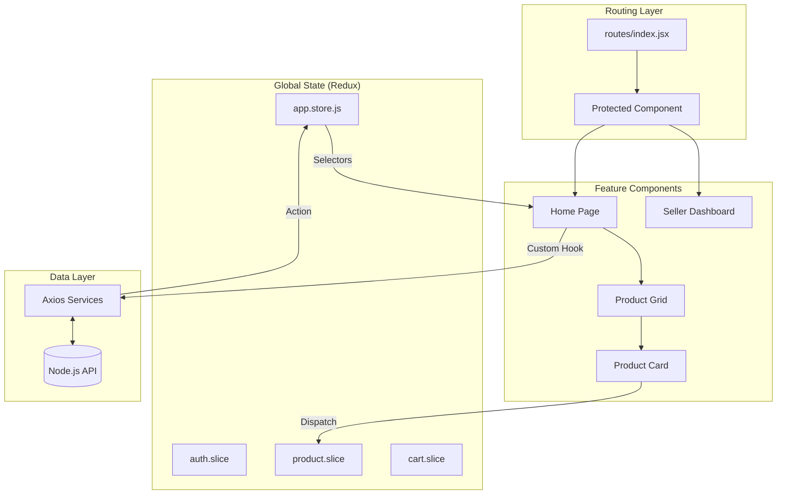

# 🛍️ Maty Shop - Frontend Documentation

Welcome to the official frontend documentation for **Maty Shop**, a premium e-commerce platform built with React, Redux Toolkit, and Vite. This document provides a comprehensive overview of the architecture, data flow, and feature implementation of the project.

---

## 1. Project Overview

**Maty Shop** is a modern, high-performance e-commerce frontend designed with a "Feature-Based Architecture". It supports:
- **Role-Based Access**: Specialized interfaces for **Buyers** and **Sellers**.
- **Product Management**: Sellers can create products and manage variants.
- **Dynamic Shopping Experience**: Real-time cart management with optimistic updates.
- **Premium UI/UX**: Built using Framer Motion for smooth animations and Tailwind CSS for high-end styling.

---

## 2. Folder Structure

The project follows a modular, feature-first organization to ensure scalability and maintainability.

```text
frontend/
├── src/
│   ├── app/                # Core Application Config
│   │   ├── App.jsx         # Root Component (Route Provider)
│   │   └── app.store.js    # Global Redux Store Configuration
│   ├── features/           # Modular Business Logic
│   │   ├── auth/          # Authentication & Authorization
│   │   ├── product/       # Browse, Search, & Seller Management
│   │   └── cart/          # Cart Operations & Persistence
│   ├── routes/             # Centralized Routing
│   │   └── index.jsx       # Route Definitions & Protection Logic
│   ├── components//        # Shared UI Components (Layouts, UI, etc.)
│   ├── assets/             # Global Styles & Assets
│   └── main.jsx            # Application Entry Point
└── vite.config.js          # Build & Dev Server Config
```

### Folder Purpose
- **`app/`**: Contains the glue that holds the app together (Redux store, Root App component).
- **`features/`**: Each subfolder is a self-contained module containing its own `components`, `hooks`, `pages`, `services` (API), and `state` (slices).
- **`routes/`**: Central location for mapping URLs to components.
- **`components/`**: generic, reusable components like buttons, containers, and layouts.

---

## 3. File-Level Explanation

### Core Files
| File | Purpose | Key Functions/Components |
| :--- | :--- | :--- |
| `main.jsx` | React entry point | Initializes React with Redux Provider. |
| `app.store.js` | Redux Store | Configures reducers for `auth`, `product`, and `cart`. |
| `routes/index.jsx` | Router | Defines public and private routes using `react-router-dom`. |

### Feature: Auth
- **`components/Protected.jsx`**: A Higher-Order Component (HOC) that guards routes. It checks user authentication and roles (e.g., `seller` vs `buyer`).
- **`pages/Login.jsx` & `Register.jsx`**: Handles user entry.
- **`services/authApi.service.js`**: Handles login, registration, and logout API calls.

### Feature: Product
- **`pages/Home.jsx`**: The storefront. Displays featured products with premium hover animations.
- **`pages/DashBoard.jsx`**: Seller-specific interface for managing inventory.
- **`hooks/useProduct.js`**: Custom hook encapsulating product fetching logic (Thunk-like behavior).

---

## 4. Component Relationships & Flow

The application uses a hierarchical structure where the **Router** acts as the top-level orchestrator.

### Hierarchy
1. **`main.jsx`** (Provider)
2. **`App.jsx`** (Layout wrapper)
3. **`AppRoutes`** (Routing Logic)
4. **`Protected`** (Authorization Layer)
5. **Feature Pages** (`Home`, `Cart`, `Dashboard`)
6. **Sub-Components** (`ProductGrid` -> `ProductCard`)

**Props Flow:**
Data is primarily distributed via **Redux**. Components use `useSelector` to read state and `useDispatch` to trigger actions. Props are used for UI-specific configurations (e.g., passing a specific `id` to a detail component).

---

## 5. State Management

Maty Shop uses **Redux Toolkit** for centralized state management.

- **`auth` slice**: Stores `user` data, `isLoading` status, and `error` messages.
- **`product` slice**: Manages `allProducts` (global catalog) and seller-specific stock.
- **`cart` slice**: Handles `items` with sophisticated sync logic. Uses **Optimistic Updates** (items are updated in UI instantly while server call completes).

**Data Flow:**
`UI Component (Trigger)` -> `Custom Hook (Dispatch)` -> `Redux Slice (Update State)` -> `UI Component (Re-render)`

---

## 6. API Integration

API calls are abstracted into **service layers** inside each feature. We use **Axios** with a base configuration for automatic cookie handling and base URLs.

| Service | Endpoint Prefix | Purpose |
| :--- | :--- | :--- |
| `authApi.js` | `/api/auth` | Login, Logout, Session check. |
| `product.api.js` | `/api/product` | Fetching products, Creating products, Variants. |
| `cart.service.js` | `/api/cart` | Syncing local cart with database. |

---

## 7. Feature Breakdown

### 🛒 Cart System
- **Optimistic UI**: When you add an item, it appears in the cart immediately.
- **Normalization**: Cart items are normalized to handle variants (e.g., Color/Size) efficiently.
- **Persistence**: Cart reflects the logged-in user's state fetched from the backend.

### 🔍 Product Discovery
- **Global Catalog**: Efficiently fetches and caches the entire product list.
- **Deep Linking**: Each product has a dedicated detail page (`/product/:id`).
- **Skeleton Loading**: Uses custom `ProductSkeleton` for a premium loading experience.

---

## 8. Architecture Diagram

### Component & Data Flow


---

## 9. Improvement Suggestions

1. **Error Boundaries**: Implement React Error Boundaries to prevent full app crashes on UI glitches.
2. **Infinite Scroll**: Optimize `Home.jsx` to load products in chunks if the catalog grows large.
3. **Form Abstraction**: Use a library like `React Hook Form` in `CreateProduct.jsx` for more robust validation.
4. **Testing**: Add Unit Tests for Redux Slices (especially `cart.slice.js`) and Integration Tests for the `Protected` component.

---

*Generated by Antigravity AI* 🚀
