# Payment & Stock Handling — Transaction-Safe Implementation

---

## 🔴 Problems Before (What Was Broken)

| # | Problem | Impact |
|---|---------|--------|
| 1 | **No stock validation** before/after payment | Two users could buy the last item simultaneously |
| 2 | **No transaction safety** | Server crash after payment = money deducted, stock not updated |
| 3 | **Operations were independent** | Partial failure left DB in corrupted state |
| 4 | **Cart not cleared** after checkout | Purchased items still showed in cart |
| 5 | **Duplicate cart items** | Same variant added twice = two separate rows instead of one merged |
| 6 | **Race conditions on `+` button** | Spam-clicking fired multiple API calls, bypassing stock limits |

---

## ✅ What Was Fixed (6 Changes)

---

### 1 — Stock Validation Before Order

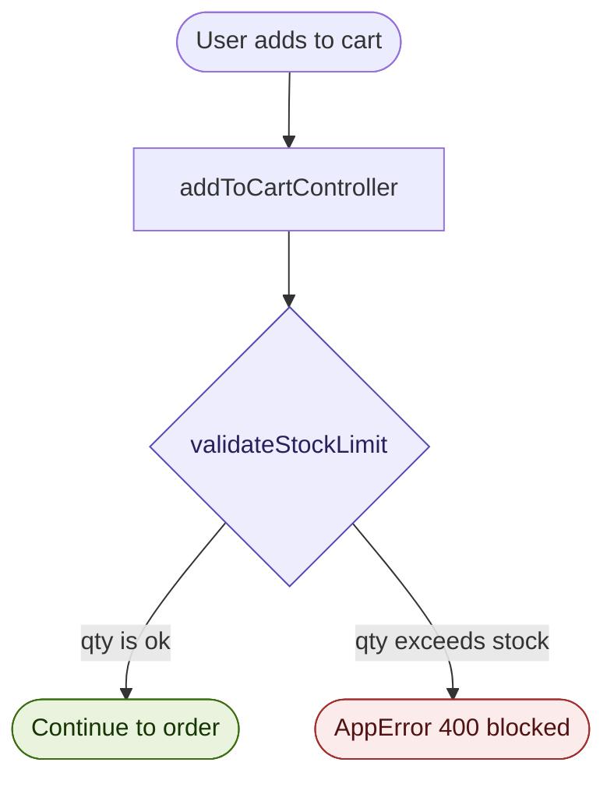

- `validateStockLimit` is a reusable helper — same logic used in cart controller **and** order creation
- Stops overselling at the earliest possible point

---

### 2 — Transaction-Based Payment Verification

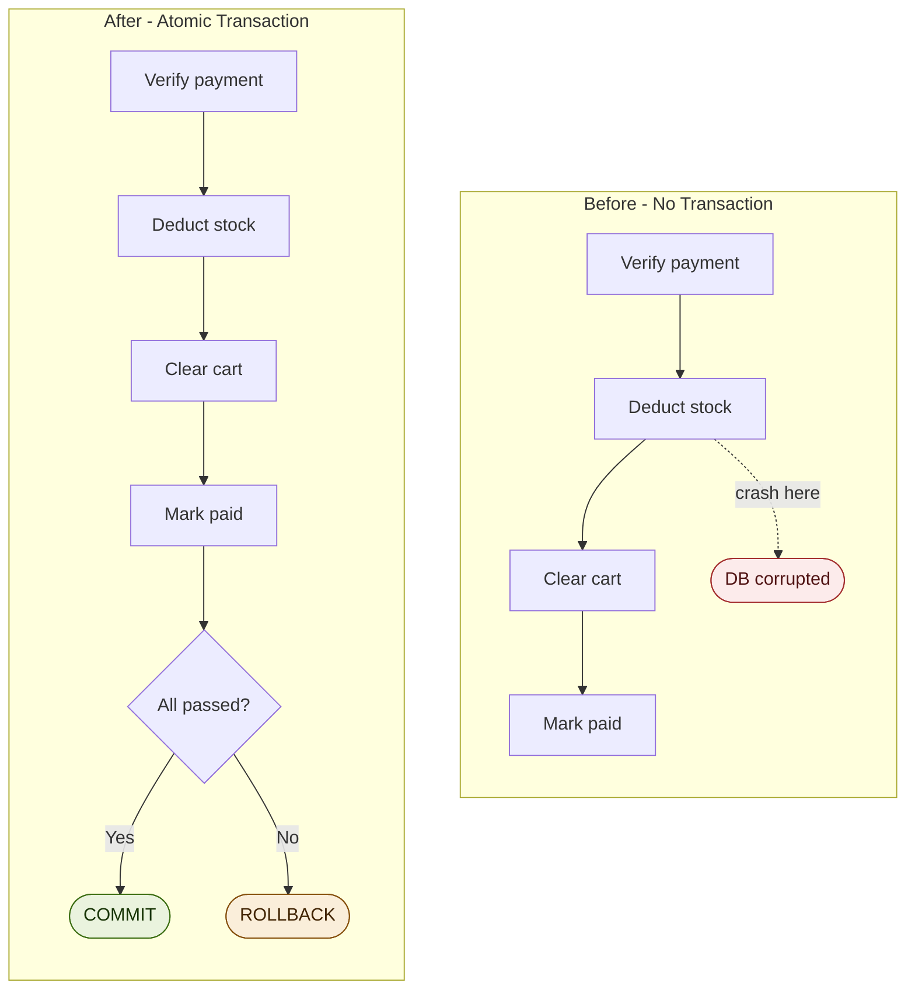

---

### 3 — Atomic Stock Deduction

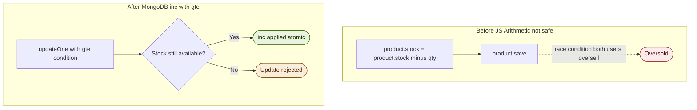

```js
// After ✅ — atomic MongoDB operator (thread-safe)
await Product.updateOne(
  { "variants._id": variantId, "variants.$.stock": { $gte: item.quantity } },
  { $inc: { "variants.$.stock": -item.quantity } },
  { session }
);
```

> **Why this matters:** If two users hit "buy" at the same millisecond, `$gte + $inc` ensures only ONE succeeds. The JS version would let both through.

---

### 4 — Cart Cleanup After Payment

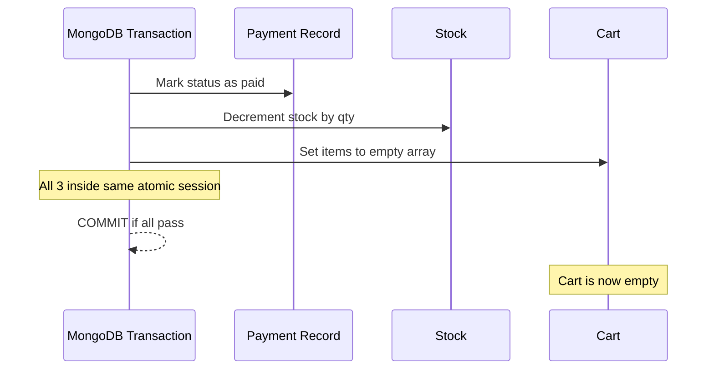

```js
// Runs inside the MongoDB transaction — same atomic session
await Cart.updateOne(
  { userId },
  { $set: { items: [] } },
  { session }
);
```

---

### 5 — Frontend Duplicate Merging

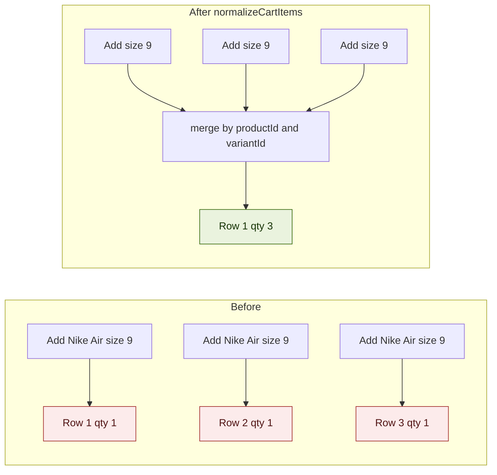

```js
// normalizeCartItems logic
items.reduce((acc, item) => {
  const key = `${item.productId}-${item.variantId}`;
  if (acc[key]) acc[key].quantity += item.quantity;
  else acc[key] = { ...item };
  return acc;
}, {});
```

---

### 6 — Race Condition Prevention (Frontend)

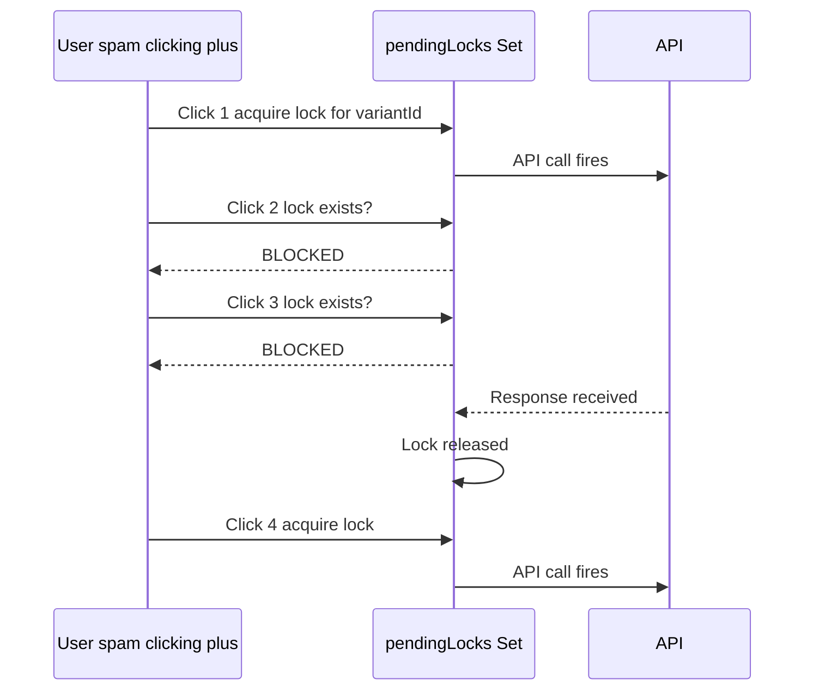

```js
const pendingLocks = useRef(new Set());

const handleQuantityChange = (variantId) => {
  if (pendingLocks.current.has(variantId)) return; // blocked
  pendingLocks.current.add(variantId);
  try {
    await updateCartAPI(variantId);
  } finally {
    pendingLocks.current.delete(variantId); // always release
  }
};
```

---

## 🔄 Complete Payment Flow (After Fix)

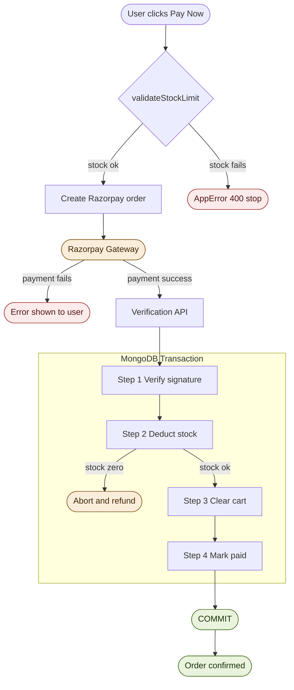

---

## 🧩 Why MongoDB Transactions — Atomicity Explained

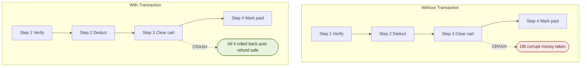

---

## 🔐 Data Safety Summary

| Risk | How It's Prevented |
|------|--------------------|
| Overselling | `$gte` check inside `updateOne` — fails atomically if stock = 0 |
| Partial DB update | MongoDB session wraps all 4 steps — any failure = full rollback |
| Duplicate processing | Payment locked at `pending` status with atomic query inside session |
| Frontend spam | `pendingLocks` Set blocks overlapping API calls per variant |
| Cart duplicates | `normalizeCartItems` merges same `productId + variantId` on render |
| Connection leak | `session.endSession()` always runs in `finally {}` block |

---

## 🧪 How to Test

### Test 1 — Cart merging

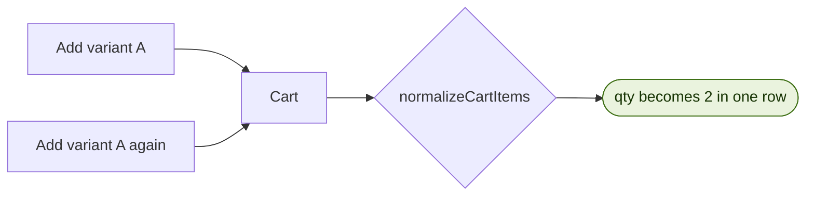

### Test 2 — Spam click protection

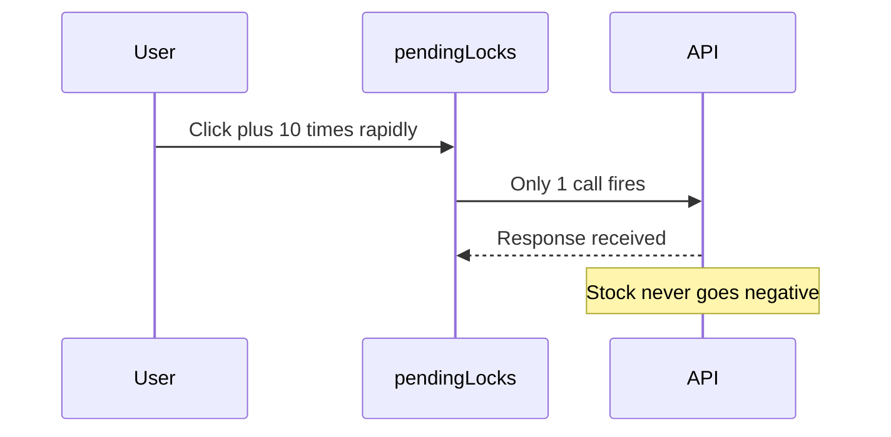

### Test 3 — Full payment flow

```
1. Add item to cart
2. Complete Razorpay checkout with test card
Expected after success:
  ✓ Stock count in DB reduced by correct qty
  ✓ Cart is empty
  ✓ Payment record status = "paid"
```

### Test 4 — Race condition simulation (advanced)

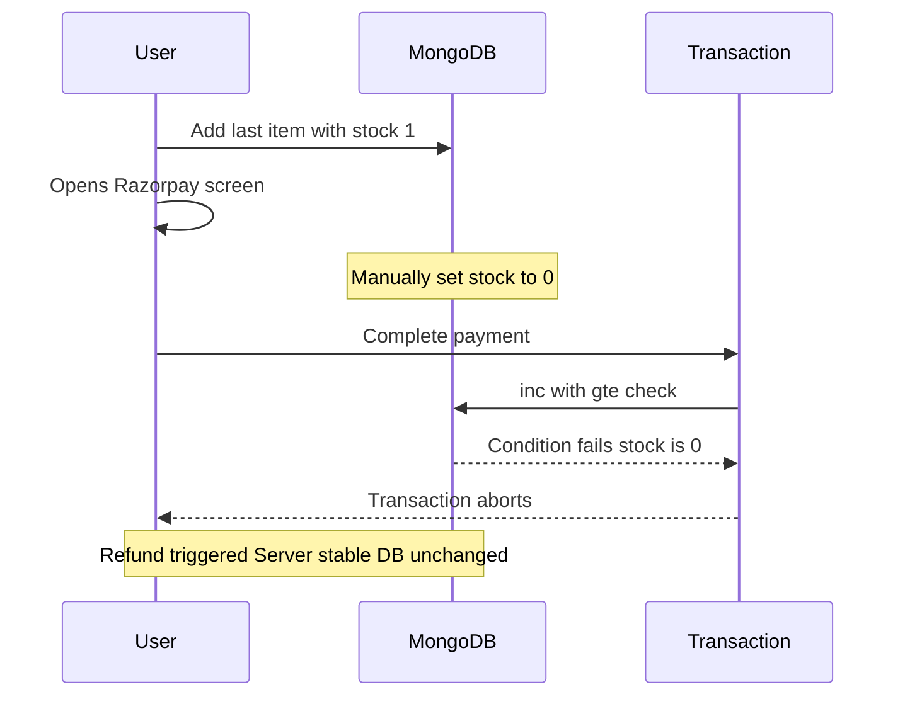

---

## 🔮 Next Steps

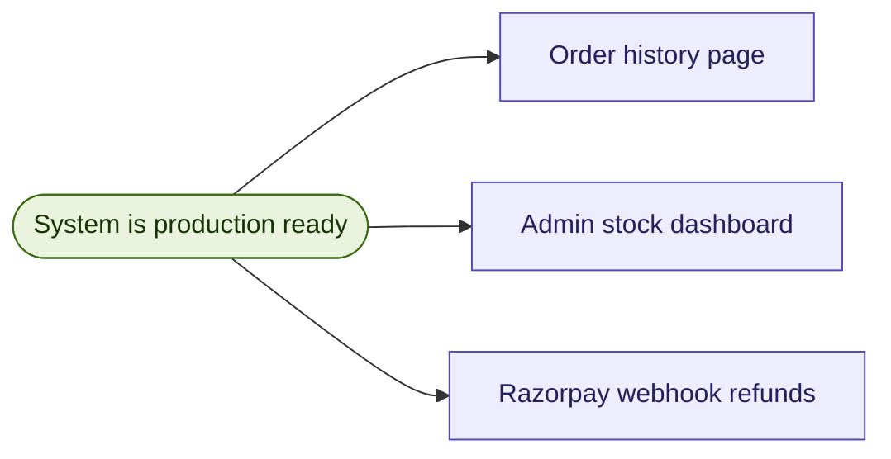