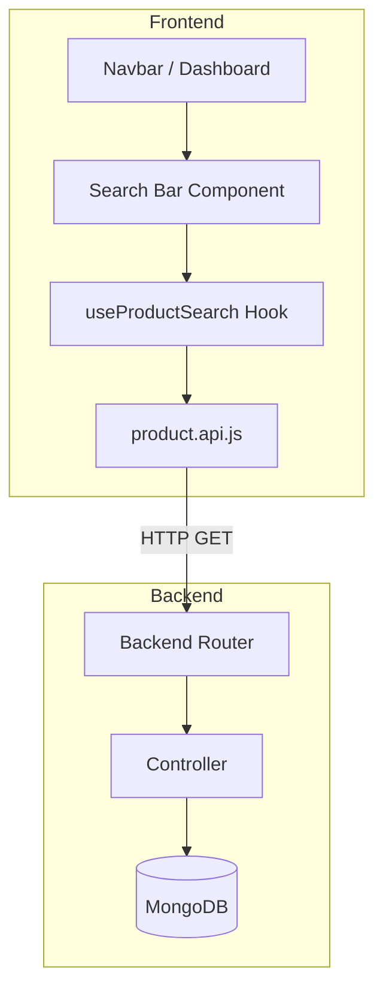
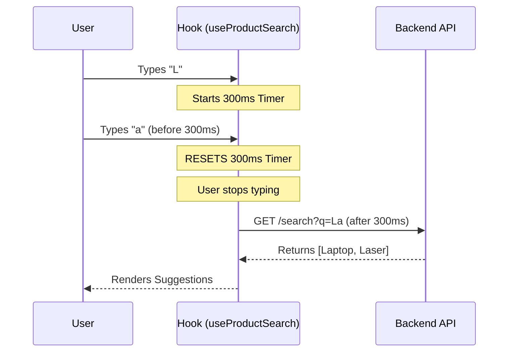

# Search Feature Documentation

This document provides a comprehensive overview of the **Search Feature** implemented in the MATYSHOP E-Commerce platform. It covers the end-to-end flow from user input on the frontend to database querying on the backend.

---

## 1. Feature Overview

The Search feature enables users and sellers to quickly find products through a real-time, debounced search system.

*   **Global Search**: Accessible from the main Navbar on every page.
*   **Seller Search**: Accessible from the Seller Dashboard.

---

## 2. Component Hierarchy & Architecture

### Relationship Breakdown
| Item | Role | Description |
| :--- | :--- | :--- |
| `useProductSearch.js` | **Hook** | Shared logic for debouncing and state management. |
| `GlobalSearchBar.jsx` | **UI** | Buyer-facing search bar in Navbar. |
| `SellerSearchBar.jsx` | **UI** | Seller-facing search bar in Dashboard. |
| `product.controller.js` | **Logic** | Executes the `$regex` query on the DB. |

---

## 3. The Data Flow (Sequence Diagram)

This diagram shows how **Debouncing** ensures we don't spam the server.

---

## 4. Search Logic Details

### Frontend (Debounce)
We use a 300ms delay. If a user types another character before 300ms passes, the previous timer is cancelled and a new one starts. This ensures the API is only called once the user pauses.

### Backend (Query)
The server uses a case-insensitive regular expression to find matches in:
*   **Title**
*   **Description**
*   **Variant Attributes** (Searches all values in the attribute Map)

Query syntax: `{ $regex: query, $options: "i" }`

---

## 5. Optimization & Edge Cases

*   **useCallback**: Used to keep function references stable so the hook doesn't re-trigger.
*   **No Results**: The UI shows a "No products found" message in the dropdown.
*   **Empty Input**: Hides the dropdown immediately.
*   **Route Order**: Search routes are defined *above* ID routes to prevent conflict.
