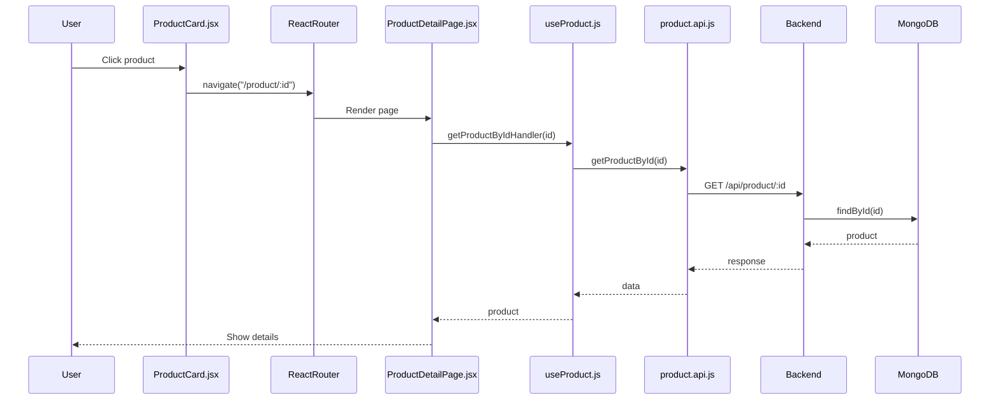
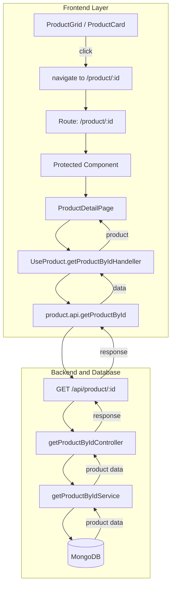

# Today's Product Click -> Full Details Flow

## 1) Goal

When user clicks a product card, app should:

1. Navigate to `/product/:id`
2. Load only Product Details page
3. Fetch product by URL `id`
4. Render product data with loading/error handling

---

## 2) Where Each Thing Lives (File Map)

| Layer                      | File                                                                 | Main Responsibility                                     |
| -------------------------- | -------------------------------------------------------------------- | ------------------------------------------------------- |
| Frontend root router       | `frontend/src/app/App.jsx`                                         | Wraps app with `BrowserRouter` and renders route tree |
| Frontend route tree        | `frontend/src/routes/index.jsx`                                    | Defines all routes, including `/product/:id`          |
| Route protection           | `frontend/src/features/auth/components/Protected.jsx`              | Auth check + optional role check                        |
| Product click source       | `frontend/src/features/product/components/product/ProductCard.jsx` | `useNavigate()` + `handleCardClick()`               |
| Product details UI + logic | `frontend/src/features/product/pages/ProductDetailPage.jsx`        | `useParams()`, fetch, loading/error, rendering        |
| Product hook methods       | `frontend/src/features/product/hooks/useProduct.js`                | `getProductByIdHandeller(productId)`                  |
| Product API client         | `frontend/src/features/product/services/product.api.js`            | `getProductById(id)` -> `GET /api/product/:id`      |
| Backend route              | `backend/src/routes/product.route.js`                              | Maps `GET /api/product/:id`                           |
| Backend controller         | `backend/src/controller/product.controller.js`                     | `getProductByIdController()`                          |
| Backend service            | `backend/src/services/product.service.js`                          | `getProductByIdService()` DB lookup                   |

---

## 3) Actual Runtime Process (Step by Step)

1. User clicks card in `ProductCard.jsx`.
2. `handleCardClick()` reads `productId` from `product._id || product.id`.
3. `navigate(`/product/${productId}`)` runs.
4. Router matches route `/product/:id` in `routes/index.jsx`.
5. `Protected` validates user login (and role only if `allowedRoles` passed).
6. `ProductDetailPage` loads.
7. `useParams()` extracts `{ id }` from URL.
8. `useEffect` calls:
   - `getProductByIdHandeller(id)` for selected product
   - `getAllProducts()` for related list
9. Hook calls API `getProductById(id)`.
10. Frontend calls backend `GET /api/product/:id`.
11. Backend controller validates ObjectId, service fetches from DB.
12. Product response returns -> UI updates.
13. Page shows:

- Main image + thumbnails
- Name, description, price
- Stock status badge
- Add to cart button
- Related products section

---

## 4) Method-Level Breakdown

## `ProductCard.jsx`

- `handleCardClick()`: single source of route navigation.
- `handleCardKeyDown()`: keyboard accessibility (`Enter` / `Space`).
- Card root has `onClick={handleCardClick}` so click anywhere navigates.

## `routes/index.jsx`

- Product details route:
  - `path="/product/:id"`
  - Renders only `<ProductDetailPage />` (inside `<Protected>`).

## `Protected.jsx`

- If `loading`: waits.
- If no user: redirects to `/login`.
- If `allowedRoles` exists and role mismatch: redirects to `/`.
- For `/product/:id`, no role restriction is passed, so any logged-in user can open details.

## `ProductDetailPage.jsx`

- Uses `const { id } = useParams()` (must match `:id` from route).
- Calls `getProductByIdHandeller(id)`.
- Handles:
  - `isLoading` skeleton
  - `error` box + retry
  - success render
- Uses `retryCount` state to re-run fetch logic safely.

## `useProduct.js`

- `getProductByIdHandeller(productId)`:
  - sets loading true
  - calls `getProductById(productId)`
  - stores product in redux via `setProduct(data.product)`
  - returns product

## `product.api.js`

- `getProductById(id)`:
  - `GET /api/product/${id}`
  - returns backend JSON

## Backend

- `product.route.js`: `productRouter.get('/:id', getProductByIdController)`
- `product.controller.js`:
  - checks valid Mongo ObjectId
  - calls service
- `product.service.js`:
  - `findById(id)`
  - throws `Product not found` if null

---

## 5) Diagram (Sequence)

---

## 6) Diagram (Component + API Flow)

---

## 7) Debug Checklist (If It Fails Again)

1. Route path must be exactly `/product/:id`.
2. `useParams()` must read `id` (not `productId`).
3. All router imports must be from `react-router-dom`.
4. `ProductCard` should pass `_id` correctly.
5. Backend route `GET /api/product/:id` must exist.
6. Browser URL should look like `/product/680...`.
7. If redirect to home/login happens, inspect `Protected.jsx` conditions.

---

## 8) Quick Test Procedure

1. Open homepage products.
2. Click any product card.
3. Confirm URL changes to `/product/<id>`.
4. Confirm Home content is not shown.
5. Confirm detail page displays image/name/description/price/stock.
6. Temporarily use invalid id in URL and verify error state is shown.
7. Click Retry and confirm fetch runs again.

---

## 9) Notes

- Method names currently use `Handeller` spelling in code; functionality is correct.
- Related products are fetched with `getAllProducts()` and filtered client-side.
- This document describes the exact current implementation paths.
