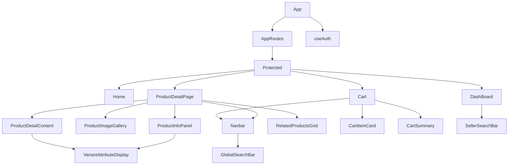
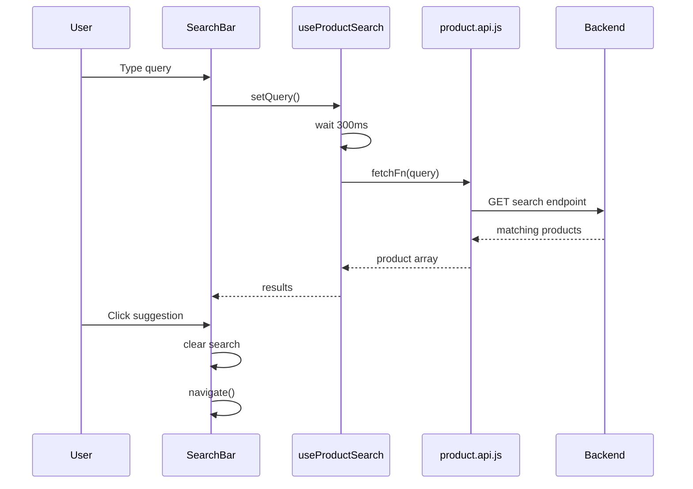
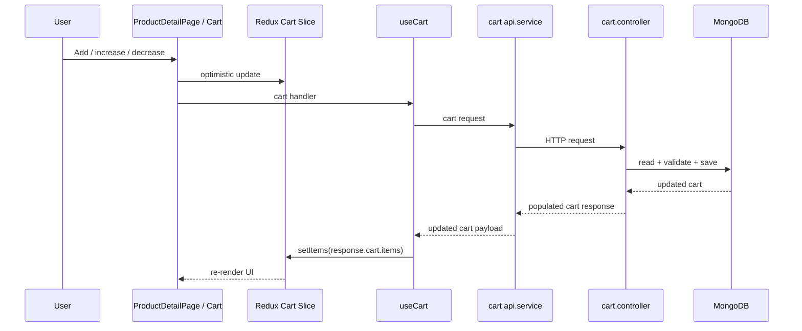
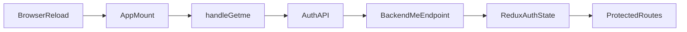
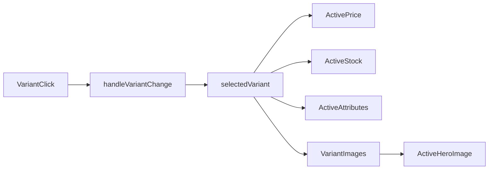

# Today's Feature & Fix Documentation

## 1. Overview

This document explains the features and fixes implemented today in the React + Node.js e-commerce project.

The main areas improved were:

1. Global product search for buyers
2. Seller product search for dashboard users
3. Product Detail Page UX and variant interaction
4. Cart add/update behavior
5. Cart Page display issues
6. Cart quantity handling and duplicate prevention
7. Session and data restore flows
8. Product navigation scroll-to-top behavior

The goal of today’s work was not just to add UI, but to make the data flow reliable:

- Search should feel fast and predictable
- Variant selection should update the UI instantly
- Cart state should stay consistent with backend truth
- Reloading the app should restore important user and cart state
- Moving between product pages should feel clean and natural

---

## 2. Feature-wise Breakdown

### 2.1 Search Feature (Global + Seller)

#### Problem

Before today’s update, the app needed a reusable search flow for:

- Buyers searching all products from the navbar
- Sellers searching only their own listings from the dashboard

Without a shared pattern, search behavior could become inconsistent and harder to maintain.

#### Solution

A shared debounced hook was used:

- `frontend/src/features/product/hooks/useProductSearch.js`

Two specialized UI components now consume it:

- `GlobalSearchBar.jsx`
- `SellerSearchBar.jsx`

#### How it Works Step-by-Step

1. User types in the input
2. `useProductSearch` stores the input in `query`
3. The hook waits for `300ms`
4. If the user keeps typing, the old timer is cleared
5. After the delay, the hook calls the provided `fetchFn`
6. Results are stored in `results`
7. The component opens a dropdown and renders suggestions
8. Clicking a result navigates to the correct page

#### Why Debounce Was Needed

Debounce prevents the app from making an API request on every key press.

That gives:

- lower backend load
- fewer unnecessary requests
- smoother typing experience

#### Buyer Search

`GlobalSearchBar.jsx`:

- uses `searchProducts(query)`
- searches all products
- lives in the shared navbar
- navigates to `/product/:id`

#### Seller Search

`SellerSearchBar.jsx`:

- uses `searchSellerProducts(query)`
- searches only the authenticated seller’s products
- lives in the dashboard
- navigates to `/seller/product/:productId`

---

### 2.2 Product Detail Page (UI + Variant Logic)

#### Problem

The Product Detail Page had three UX issues:

1. Variant changes were not cleanly reflected across the UI
2. The main image lacked a premium interaction
3. Variant attributes were displayed as plain text instead of meaningful UI

#### Solution

The page was refactored so one `selectedVariant` state drives:

- active image
- active price
- active stock
- displayed attributes
- lower variant comparison state

New supporting components were introduced:

- `ProductImageGallery.jsx`
- `ProductInfoPanel.jsx`
- `ProductDetailContent.jsx`
- `VariantAttributeDisplay.jsx`
- `RelatedProductsGrid.jsx`

#### How Variant Selection Works

1. The page fetches the product and normalizes `variantOptions`
2. A default available variant is selected
3. Clicking a variant card calls `handleVariantChange(variantEntry)`
4. `selectedVariant` is updated
5. React re-renders the page
6. Derived values update automatically:
   - `priceText`
   - `stockText`
   - `selectedVariantAttributes`
   - `heroImages`

#### Why This Fix Was Needed

Previously, the page mixed:

- selected variant id
- lookup logic
- fallback logic
- extra bookkeeping

That made variant behavior harder to reason about.

Now the selected variant object is the single source of truth.

#### Image UX Improvement

`ProductImageGallery.jsx` now adds:

- thumbnail switching
- smooth image transition
- lightweight hover zoom using CSS scale

This gives an Amazon-style product feel without using a heavy image magnifier library.

#### Attribute UI Improvement

`VariantAttributeDisplay.jsx` improves attribute rendering:

- color-like attributes render as swatches
- size-like attributes render as stronger chips
- other attributes render as readable badges

This makes variant information easier to scan.

---

### 2.3 Cart System

#### Problem

The cart system had several connected issues:

1. Same product variant could appear as duplicate rows
2. Cart responses were inconsistent
3. Quantity changes were not fully persisted
4. Cart UI sometimes had incomplete product data

#### Root Cause

The backend `addToCartController` had different response shapes:

- new item creation returned `cart`
- existing item update returned `updatedCart` from `updateOne`

`updateOne` only returns a write result, not a populated cart.

That caused the frontend to lose the rich `product` object shape expected by the UI.

#### Solution

The backend cart flow was simplified:

- If the same `product + variant` already exists, increase `quantity`
- Do not create a new cart row
- Always save the cart document directly
- Always return a populated cart via `populate("items.product")`

#### Files Involved

- `backend/src/controller/cart.controller.js`
- `backend/src/routes/cart.route.js`
- `backend/src/model/cart.model.js`
- `frontend/src/features/cart/hooks/useCart.js`
- `frontend/src/features/cart/services/api.service.js`
- `frontend/src/features/cart/state/cart.slice.js`

#### Add to Cart Flow

1. User clicks Add to Cart on product UI
2. Frontend performs optimistic Redux update
3. Frontend calls `/api/cart/add/:productId/:variantId/:quantity`
4. Backend checks:
   - product exists
   - variant exists
   - stock is enough
5. Backend:
   - increases existing cart item quantity, or
   - pushes a new cart item
6. Backend returns the populated cart
7. Frontend replaces local cart state with server data

#### Duplicate Prevention

Cart items are uniquely identified by:

`productId::variantId`

This key is created by:

- `getCartItemKey(item)`

That key is used in:

- optimistic updates
- quantity updates
- item removal

As a result:

- same product + same variant = one cart row
- only quantity changes

---

### 2.4 Cart Page Fix (Title, Image, Price Issue)

#### Problem

Cart items sometimes showed:

- `Untitled Product`
- missing image
- missing full product details

#### Root Cause

The cart UI depends on hydrated `item.product` data.

When the backend returned an unpopulated update result instead of a populated cart, the frontend no longer had:

- `product.title`
- `product.images`
- `product.price`

#### Solution

The backend now always returns a populated cart.

The frontend also uses safe helpers:

- `getProductTitle(product)`
- `getPrimaryImage(product)`
- `getUnitPrice(item)`

These helpers live in:

- `frontend/src/features/cart/utils/cart.utils.js`

#### Result

Cart rows now reliably show:

- correct product title
- primary image
- correct unit price
- subtotal

---

### 2.5 Cart Quantity Handling

#### Problem

The `+` button did not reliably increase quantity from the cart page, even when stock was available.

Also:

- `-` only changed Redux locally
- remove also only changed Redux locally

So the backend and frontend could drift apart.

#### Solution

A new backend quantity endpoint was added:

`PATCH /api/cart/item/:productId/:variantId/:quantity`

This endpoint supports:

- exact quantity update
- removal by sending `0`

#### Frontend Update Logic

`Cart.jsx` now uses:

- `handleAddToCart()` for `+`
- `handleUpdateCartItemQuantity()` for `-`
- `handleUpdateCartItemQuantity(...quantity: 0)` for remove

#### Optimistic UI Strategy

The cart page now follows this pattern:

1. Save a snapshot of current cart items
2. Update Redux immediately
3. Call backend
4. If request succeeds:
   - replace cart with server truth
5. If request fails:
   - restore snapshot
   - show error toast

This gives a fast UI while keeping backend as the final source of truth.

#### Stock Protection

Stock is checked in two places:

1. Frontend blocks obviously invalid increase actions
2. Backend validates stock before saving

That prevents stale UI from creating invalid quantities.

---

### 2.6 Hydration / State Persistence

This project does not use browser local storage persistence for Redux today.

Instead, hydration happens by re-fetching trusted server state after reload.

#### 2.6.1 User Session Restore

`frontend/src/app/App.jsx` calls:

- `handleGetme()`

`handleGetme()` lives in:

- `frontend/src/features/auth/hooks/useAuth.js`

It requests:

- `GET /api/auth/me`

If the session cookie is still valid:

- Redux auth state is restored with the current user

This is why protected routes can survive reload.

#### 2.6.2 Cart Restore on Reload

The cart page calls:

- `handleGetCart()`

This loads the latest server cart and stores it in Redux.

That means cart state is restored from the backend, not from stale local memory.

#### 2.6.3 Seller Dashboard Data Reload

The product slice stores lightweight fetch flags:

- `hasFetchedSellerProducts`
- `isFetchingSellerProducts`
- `hasFetchedAllProducts`
- `isFetchingAllProducts`

These flags prevent duplicate network requests.

When product data changes, `UseProduct` invalidates the flags:

- after `createProductHandeler`
- after `updateProductVarientHandeler`

That ensures buyer and seller lists reload cleanly when needed.

---

### 2.7 Navigation Fix: Scroll to Top on Product Click

#### Problem

When a user clicked a product from related products while already near the bottom of the page:

- route changed correctly
- but scroll position stayed low

That felt broken because the user landed in the middle or bottom of the next product page.

#### Solution

`ProductDetailPage.jsx` now listens to the route param `id` and runs:

```js
window.scrollTo({ top: 0, left: 0, behavior: "auto" });
```

#### Result

Any product navigation to `/product/:id` now starts from the top of the page.

---

## 3. File & Folder Mapping

### Backend Files

#### `backend/src/controller/cart.controller.js`

Purpose:

- add to cart
- increase quantity for duplicate variant
- update exact quantity
- remove item with quantity `0`
- return populated cart

Connections:

- uses `cartModel`
- uses `productModel`
- called by `cart.route.js`

#### `backend/src/routes/cart.route.js`

Purpose:

- expose cart endpoints

Routes:

- `GET /api/cart/add/:productId/:variantId/:quantity`
- `PATCH /api/cart/item/:productId/:variantId/:quantity`
- `GET /api/cart/get`

#### `backend/src/model/cart.model.js`

Purpose:

- define cart schema
- store:
  - `user`
  - `items.product`
  - `items.varient`
  - `items.quantity`
  - `items.price`

---

### Frontend Search Files

#### `frontend/src/features/product/hooks/useProductSearch.js`

Purpose:

- reusable debounced search logic

Used by:

- `GlobalSearchBar.jsx`
- `SellerSearchBar.jsx`

#### `frontend/src/features/product/components/product/GlobalSearchBar.jsx`

Purpose:

- buyer-facing product search in navbar

Uses:

- `useProductSearch`
- `searchProducts`
- `useNavigate`

#### `frontend/src/features/product/components/seller/SellerSearchBar.jsx`

Purpose:

- seller-facing product search in dashboard

Uses:

- `useProductSearch`
- `searchSellerProducts`
- `useNavigate`

---

### Frontend Product Detail Files

#### `frontend/src/features/product/pages/ProductDetailPage.jsx`

Purpose:

- fetch one product
- manage `selectedVariant`
- manage gallery image
- manage add-to-cart flow
- show related products
- scroll to top on product change

Uses:

- `UseProduct`
- `useCart`
- `ProductImageGallery`
- `ProductInfoPanel`
- `ProductDetailContent`
- `RelatedProductsGrid`

#### `frontend/src/features/product/components/product-detail/ProductImageGallery.jsx`

Purpose:

- show active image
- show thumbnails
- provide hover zoom effect

#### `frontend/src/features/product/components/product-detail/ProductInfoPanel.jsx`

Purpose:

- show title, price, stock
- render top-level variant controls
- render selected attributes
- show Add to Cart CTA

#### `frontend/src/features/product/components/product-detail/ProductDetailContent.jsx`

Purpose:

- show long-form detail text
- show highlights
- show lower visual variant comparison grid

#### `frontend/src/features/product/components/product-detail/VariantAttributeDisplay.jsx`

Purpose:

- render color swatches
- render size chips
- render fallback badges

#### `frontend/src/features/product/components/product-detail/RelatedProductsGrid.jsx`

Purpose:

- show related products
- navigate to another product page

---

### Frontend Cart Files

#### `frontend/src/features/cart/services/api.service.js`

Purpose:

- define cart API calls

Functions:

- `addToCart`
- `getCart`
- `updateCartItemQuantity`

#### `frontend/src/features/cart/hooks/useCart.js`

Purpose:

- wrap cart API calls
- sync responses into Redux

#### `frontend/src/features/cart/state/cart.slice.js`

Purpose:

- store cart items
- store loading state
- store error state
- support optimistic updates and rollback

#### `frontend/src/features/cart/utils/cart.utils.js`

Purpose:

- normalize ids
- resolve titles, prices, images
- calculate keys and totals

#### `frontend/src/features/cart/pages/Cart.jsx`

Purpose:

- fetch server cart
- render cart UI
- handle increase/decrease/remove
- manage optimistic updates

#### `frontend/src/features/cart/components/CartItemCard.jsx`

Purpose:

- display one cart row
- show quantity controls
- show subtotal

#### `frontend/src/features/cart/components/CartSummary.jsx`

Purpose:

- show summary totals and checkout CTA

---

### Auth / Hydration / Product Loading Files

#### `frontend/src/app/App.jsx`

Purpose:

- restore user session on first load

#### `frontend/src/features/auth/hooks/useAuth.js`

Purpose:

- login
- register
- restore current user with `getMe`

#### `frontend/src/features/auth/components/Protected.jsx`

Purpose:

- block routes until auth finishes loading
- redirect unauthorized users

#### `frontend/src/features/product/hooks/useProduct.js`

Purpose:

- product fetching and cache invalidation

#### `frontend/src/features/product/state/product.slice.js`

Purpose:

- store buyer and seller product data
- track fetch/hydration flags

#### `frontend/src/features/product/pages/DashBoard.jsx`

Purpose:

- load seller products
- show seller search
- render seller inventory cards

---

## 4. Data Flow Explanation

### 4.1 Search Flow

User Action -> Search input -> `useProductSearch` -> Product API -> Backend search endpoint -> Results -> Suggestion dropdown -> Navigation

### 4.2 Product Detail Variant Flow

User Action -> Variant click -> `handleVariantChange` -> `selectedVariant` state -> Derived price/stock/images -> Product detail components re-render

### 4.3 Add to Cart Flow

User Action -> `handleAdd` -> optimistic Redux update -> `useCart.handleAddToCart` -> cart API -> backend controller -> populated cart response -> Redux `setItems` -> UI refresh

### 4.4 Cart Increase Flow

User Action -> `Cart.handleIncrease` -> optimistic `setItemQuantity` -> `handleAddToCart` -> backend merge logic -> populated cart -> Redux refresh -> UI update

### 4.5 Cart Decrease / Remove Flow

User Action -> `Cart.handleDecrease` or `Cart.handleRemove` -> optimistic Redux change -> `handleUpdateCartItemQuantity` -> backend quantity update endpoint -> populated cart -> Redux refresh -> UI update

### 4.6 User Session Restore Flow

App mount -> `App.jsx` -> `handleGetme()` -> auth API -> backend `/me` -> Redux `setUser` -> `Protected` routes render

### 4.7 Seller Dashboard Reload Flow

Dashboard mount -> `getProductHandeler()` -> product API -> Redux `setProduct` -> seller product cards render

After product creation/variant creation:

- fetch flags are invalidated
- next fetch loads fresh data

---

## 5. Component Relationships

### Product Detail Page

- `ProductDetailPage`
  - `Navbar`
    - `GlobalSearchBar`
  - `ProductImageGallery`
  - `ProductInfoPanel`
    - `VariantAttributeDisplay`
  - `ProductDetailContent`
    - `VariantAttributeDisplay`
  - `RelatedProductsGrid`

### Cart Page

- `Cart`
  - `Navbar`
    - `GlobalSearchBar`
  - `CartItemCard`
  - `CartSummary`

### Seller Dashboard

- `DashBoard`
  - `SellerSearchBar`

---

## 6. API Flow

### Product Search APIs

#### Buyer Search

Frontend:

- `searchProducts(query)`

Request:

- `GET /api/product/search?q=term`

Response:

- matching products

#### Seller Search

Frontend:

- `searchSellerProducts(query)`

Request:

- `GET /api/product/seller/search?q=term`

Response:

- matching seller-owned products

---

### Cart APIs

#### Add to Cart

Frontend:

- `addToCart({ productId, variantId, quantity })`

Request:

- `GET /api/cart/add/:productId/:variantId/:quantity`

Response:

- populated updated cart

#### Fetch Cart

Frontend:

- `getCart()`

Request:

- `GET /api/cart/get`

Response:

- populated cart

#### Update Exact Quantity

Frontend:

- `updateCartItemQuantity({ productId, variantId, quantity })`

Request:

- `PATCH /api/cart/item/:productId/:variantId/:quantity`

Response:

- populated cart

---

### Auth API

#### Restore Session

Frontend:

- `getMe()`

Request:

- `GET /api/auth/me`

Response:

- authenticated user object

---

## 7. State Management (Redux / Hooks)

### Auth State

Stored in:

- `auth.slice.js`

Fields:

- `user`
- `isLoading`
- `error`

Hydration:

- restored on app load by `handleGetme()`

### Product State

Stored in:

- `product.slice.js`

Fields:

- `product`
- `allProducts`
- `isLoading`
- `error`
- buyer fetch flags
- seller fetch flags

Hydration / reload behavior:

- data is fetched when needed
- flags prevent duplicate requests
- invalidation forces fresh fetch after create/update

### Cart State

Stored in:

- `cart.slice.js`

Fields:

- `items`
- `isLoading`
- `error`

Behavior:

- optimistic updates for fast interaction
- server response replaces local state
- snapshots allow rollback on failure

---

## 8. Diagrams

### 8.1 Component Hierarchy



### 8.2 Search Flow



### 8.3 Cart Flow



### 8.4 Session Restore Flow



### 8.5 Variant Flow



---

## 9. Code Documentation Added Today

Documentation comments were added to the most important files touched in today’s work.

### Backend

- `backend/src/controller/cart.controller.js`
- `backend/src/routes/cart.route.js`
- `backend/src/model/cart.model.js`

### Frontend Cart

- `frontend/src/features/cart/services/api.service.js`
- `frontend/src/features/cart/hooks/useCart.js`
- `frontend/src/features/cart/state/cart.slice.js`
- `frontend/src/features/cart/utils/cart.utils.js`
- `frontend/src/features/cart/components/CartItemCard.jsx`
- `frontend/src/features/cart/pages/Cart.jsx`

### Frontend Search / Product Detail / Auth

- `frontend/src/features/product/hooks/useProductSearch.js`
- `frontend/src/features/product/components/product/GlobalSearchBar.jsx`
- `frontend/src/features/product/components/seller/SellerSearchBar.jsx`
- `frontend/src/features/auth/hooks/useAuth.js`
- `frontend/src/app/App.jsx`
- `frontend/src/features/product/hooks/useProduct.js`
- `frontend/src/features/product/pages/ProductDetailPage.jsx`
- `frontend/src/features/product/components/product-detail/ProductImageGallery.jsx`
- `frontend/src/features/product/components/product-detail/ProductInfoPanel.jsx`
- `frontend/src/features/product/components/product-detail/ProductDetailContent.jsx`
- `frontend/src/features/product/components/product-detail/VariantAttributeDisplay.jsx`
- `frontend/src/features/product/components/product-detail/RelatedProductsGrid.jsx`

These comments explain:

- purpose
- params
- returns
- role in the data flow

---

## 10. Key Learnings

### Debounce

Used in search to wait briefly before sending API requests.

Why it matters:

- improves performance
- reduces API spam
- improves typing experience

### State Hydration

Hydration means rebuilding UI state after reload from trusted backend APIs.

In this project:

- auth is restored via `/me`
- cart is restored via `/api/cart/get`
- seller product data is re-fetched when needed

### Variant Handling

A product can have multiple variants with different:

- prices
- stock
- images
- attributes

Using one `selectedVariant` object as the source of truth makes the UI much easier to maintain.

### API Integration

Frontend should not assume a successful write means it already has the final UI data.

The safer pattern is:

1. validate on backend
2. save on backend
3. return hydrated data
4. replace frontend state with server truth

### Optimistic UI

Optimistic updates make the UI feel instant.

But they must always include:

- snapshot before change
- rollback on failure

That pattern is now used in cart updates.

---

## 11. Summary

Today’s work improved both UX and reliability.

The biggest technical improvements were:

- reusable debounced search
- cleaner selected-variant architecture
- backend cart merge logic
- exact quantity update endpoint
- reliable populated cart responses
- stronger reload/session restore behavior
- better product navigation UX

The result is a project that is:

- easier to understand
- easier to maintain
- more consistent for users
- better aligned with real-world e-commerce behavior
